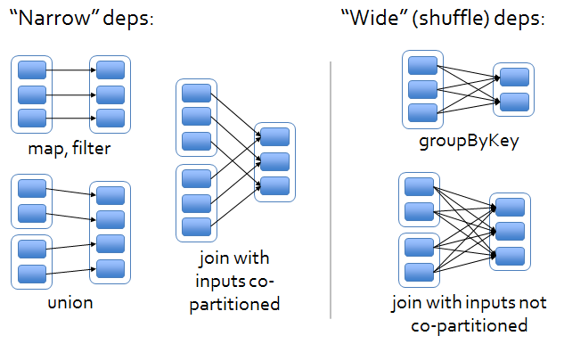

> 如无特别说明，本文源码版本为 spark 2.3.4  
> 两个rdd join时产生新的rdd，是宽依赖，还是窄依赖？

## join transformation



以上图片是个经常用来解释宽窄依赖的经典图，来源于论文\<\<Resilient Distributed Datasets: A Fault-Tolerant Abstraction for In-Memory Cluster Computing>>。以下这段话也来自与该论文：

> join: Joining two RDDs may lead to either two nar- row dependencies (if they are both hash/range partitioned with the same partitioner), two wide dependencies, or a mix (if one parent has a partitioner and one does not). In either case, the output RDD has a partitioner (either one inherited from the parents or a default hash partitioner)

或许我们会好奇，为什么同样是join操作，有时是宽依赖，有时窄依赖？我们先从两个简单的实验开始，再从源码看其实现方式。

### rdd1和rdd2的partitioner不同

假设我们有rdd1和rdd2，其partitioner分别为partitioner1、partitioner2。分区器定义如下：   

partitioner1：

```
numPartiton = 3
func = x mod numPartiton
```
 
partitioner2：

```
numPartiton = 5
func = (x  * 3) mod numPartiton
```

rdd1的初始分布如下：

```
partition0: (0, "a"), (3, "e")
partition1: (1, "b")
partition2: (2, "c")
```

rdd2的初始分布如下：

```
partition0: (0, "e"), (0, "j")
partition1: (2, "f")
partition2: (4, "g")
partition3: (1, "h"), (6, "k")
partition4: (3, "i")
```

rdd3=rdd2.join(rdd1)，rdd3数据分布如下：

```
partition0: (0, ("e", "a")), (0, ("j", "a"))
partition1: (2, ("f", "c"))
partition2: 
partition3: (1, ("h", "b"))
partition4: (3, ("i", "e"))
```

rdd3和rdd1以及rdd2的parittion之间的依赖关系如下：

```
rdd1.partition0 ==> rdd3.partition0, rdd3.partition4 
rdd1.partition1 ==> rdd3.partition3  
rdd1.partition2 ==> rdd3.partition2  

rdd2.partition0 ==> rdd3.partition0  
rdd2.partition1 ==> rdd3.partition1 
rdd2.partition2 ==> rdd3.partition2  
rdd2.partition3 ==> rdd3.partition3  
rdd2.partition4 ==> rdd3.partition4  
```


可以看到rdd1的parittion0 同时被rdd3的partition0和partition4依赖，父rdd的一个parittion被子rdd多个parittion依赖，所以此时rdd3对rdd1的依赖为宽依赖。

<!--more-->

### rdd1和rdd2的partitioner相同

我们统一rdd1和rdd2的partitioner，再观察其依赖状态。

partitioner：

```
numPartiton = 3
func = x mod numPartiton
```

rdd1的初始分布如下:

```
partition0: (0, "a"), (3, "e")
partition1: (1, "b")
partition2: (2, "c")
```

rdd2的初始分布如下:

```
partition0: (0, "e"), (0, "j"), (3, "i"), (6, "k")
partition1: (1, "h"), (4, "g")
partition2: (2, "f")
```

rdd3=rdd2.join(rdd1)，rdd3数据分布如下：

```
partition0: (0, ("e", "a")), (0, ("j","a")), (3, ("i", "e"))
partition1: (1, ("h", "b"))
partition2: (2, ("f", "c"))
```

rdd3和rdd1以及rdd2的parittion之间的依赖关系如下：

```
rdd1.partition0 ==> rdd3.partition0  
rdd1.partition1 ==> rdd3.partition1  
rdd1.partition2 ==> rdd3.partition2   
rdd1.partition3 ==> rdd3.partition3  

rdd2.partition0 ==> rdd3.partition0  
rdd2.partition1 ==> rdd3.partition1  
rdd2.partition2 ==> rdd3.partition2   
rdd2.partition3 ==> rdd3.partition3 
``` 

rdd1和rdd2的每个parittion都只被rdd3的一个partition依赖，故rdd3对rdd1和rdd2的依赖为窄依赖。

### 小结

通过对比两种情况，可以发现当两个父rdd的partitioner相同时，根本不会发生partition间的传输。这也是合理的，因为子rdd根据key进行计算分区时，也会和当前所在分区一致。parittioner不同时，其中一个至少会发生shuffle。当两个父rdd均没有parittioner时，将会进行两次shulle。

## 分析源码实现

```scala
package org.apache.spark.rdd.PairRDDFunctions

  /**
   * Return an RDD containing all pairs of elements with matching keys in `this` and `other`. Each
   * pair of elements will be returned as a (k, (v1, v2)) tuple, where (k, v1) is in `this` and
   * (k, v2) is in `other`. Performs a hash join across the cluster.
   */
  def join[W](other: RDD[(K, W)]): RDD[(K, (V, W))] = self.withScope {
    join(other, defaultPartitioner(self, other))
  }

  /**
   * Return an RDD containing all pairs of elements with matching keys in `this` and `other`. Each
   * pair of elements will be returned as a (k, (v1, v2)) tuple, where (k, v1) is in `this` and
   * (k, v2) is in `other`. Uses the given Partitioner to partition the output RDD.
   */
  def join[W](other: RDD[(K, W)], partitioner: Partitioner): RDD[(K, (V, W))] = self.withScope {
    this.cogroup(other, partitioner).flatMapValues( pair =>
      for (v <- pair._1.iterator; w <- pair._2.iterator) yield (v, w)
    )
  }
  
  /**
   * For each key k in `this` or `other`, return a resulting RDD that contains a tuple with the
   * list of values for that key in `this` as well as `other`.
   */
  def cogroup[W](other: RDD[(K, W)], partitioner: Partitioner)
      : RDD[(K, (Iterable[V], Iterable[W]))] = self.withScope {
    if (partitioner.isInstanceOf[HashPartitioner] && keyClass.isArray) {
      throw new SparkException("HashPartitioner cannot partition array keys.")
    }
    val cg = new CoGroupedRDD[K](Seq(self, other), partitioner)
    cg.mapValues { case Array(vs, w1s) =>
      (vs.asInstanceOf[Iterable[V]], w1s.asInstanceOf[Iterable[W]])
    }
  }
  
--------------
package org.apache.spark.rdd.CoGroupedRDD

  override def getDependencies: Seq[Dependency[_]] = {
    rdds.map { rdd: RDD[_] =>
      if (rdd.partitioner == Some(part)) {
        logDebug("Adding one-to-one dependency with " + rdd)
        new OneToOneDependency(rdd)
      } else {
        logDebug("Adding shuffle dependency with " + rdd)
        new ShuffleDependency[K, Any, CoGroupCombiner](
          rdd.asInstanceOf[RDD[_ <: Product2[K, _]]], part, serializer)
      }
    }
  }

```

考虑rdd3=rdd1.join(rdd2)，什么时候会进行shuffle，什么时候不会？rdd3=rdd1.join(rdd2) 调用栈：

1. rdd1通过隐式转换为PairRDDFunctions（通过rddToPairRDDFunctions进行隐式转换）
2. 调用`org.apache.spark.rdd.PairRDDFunctions`的`join[W](other: RDD[(K, W)])`方法
3. 使用 defaultPartitioner(self, other) 获取或者创建partitioner，并调用`join(other, defaultPartitioner(self, other))`方法，defaultPartitioner的计算方法见上篇文章`Spark学习系列之二：rdd分区数量分析`。
4. 通过CoGroupedRDD\[K](Seq(self, other), partitioner)创建rdd，聚合父rdd相同key到一个长度为二的数组中，每个数组的类型为Iterable，即 RDD[(K, (Iterable[V], Iterable[W]))]。
5. 在CoGroupedRDD的getDependencies中，rdds为rdd1和rdd2组成的元组，rdds.map遍历该元组： 
	- 元组中的的parittioner和defaultPartitioner返回相等时（parittioner是否相等取决其实现的equal方法，如HashPartitioner实现的equal方法只有同种类型的Partitioner，并且分区数量一致，返回true），返回OneToOneDependency。它是NarrowDependency的实现类，代表子rdd的一个paritition只依赖父rdd的一个parittion，其实现了getParents(partitionId: Int)方法，可以根据子rdd的partitionId获取依赖父rdd的partitionId的List，并且返回的List大小为1.
	- 如果不相等，则返回ShuffleDependency。
6. 综上所述，可能出现四种情况
	- rdd3与rdd1和rdd2均为窄依赖
	- rdd3与rdd1和rdd2均为宽依赖
	- rdd3与rdd1为窄依赖，与rdd2为宽依赖
	- rdd3与rdd2为窄依赖，与rdd1为宽依赖


> 本文为学习过程中产生的总结，由于学艺不精可能有些观点或者描述有误，还望各位同学帮忙指正，共同进步。
